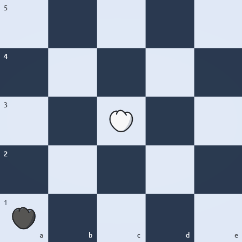
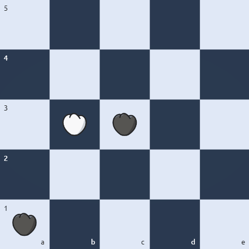
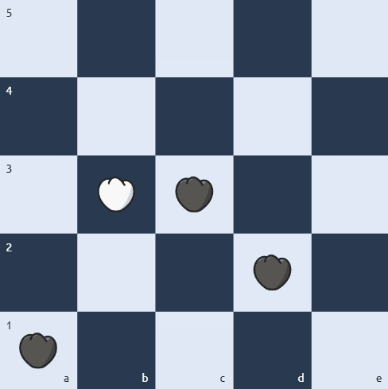

# Jumpdog

An [Alpha-beta pruning](https://en.wikipedia.org/wiki/Alpha%E2%80%93beta_pruning) implementaion that plays the Sudanese board game Jumpdog :dog:. [live game](https://jumpdog.vercel.app/).

## Quick start

Ready to jump into the game? Here's how to get started:

1. Clone the Repository:

```bash
git clone https://github.com/aelkheir/jumpdog.git
```

2. Install Dependencies:
   Navigate to the project directory and run npm install to install all required dependencies.

```bash
cd jumpdog
```

```bash
npm install
```

3. Launch the Game:
   Execute `npm run dev` to start the game. Open your browser and navigate to http://localhost:3000 to play!

```bash
npm run dev
```

## How to play

### Basic moves

Each piece can move one square either horizontally or vertically, diagonal movements are not allowed.



### Capture moves

Simple captures: you capture your opponent piece by hoping over said piece and landing in the next empty square.



Multiple capture moves: you can perform multiple captures when you get the oppertunity to perform a sequence of simple captures in a single round.


